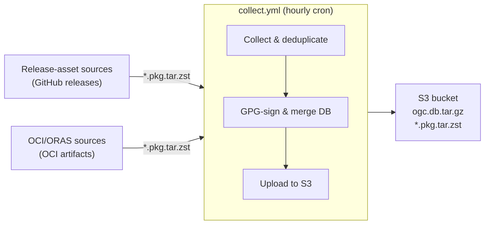

# ogc-arch-repo — Central Arch Package Repository

> Publishes the `ogc` Arch Linux pacman repository — one PGP-signed home for packages from many source repos.

> **Status:** Planned, not yet implemented. This document is the scope & overview for the central packaging repository. It is self-contained: a reader landing here with no other context should understand what this repo does, how to use its output, and how to contribute a new package. Operator/runbook details live in [`OPERATIONS.md`](./OPERATIONS.md).

## Using the `ogc` repo

End users consume the published bucket as a pacman repository. To use it:

1. Add the repo to `/etc/pacman.conf`:
   ```ini
   [ogc]
   Server = <BUCKET_PUBLIC_URL>
   ```
   Replace `<BUCKET_PUBLIC_URL>` with the public URL the bucket is served at (the same value the workflow fetches `ogc.db.tar.gz` from).

2. Import the repo's PGP key so pacman can verify package and database signatures:
   ```bash
   sudo pacman-key --recv-keys <KEY_ID>
   sudo pacman-key --lsign-key <KEY_ID>
   ```
   See [PGP key](#pgp-key) below for the fingerprint and where the public key is published.

3. Install packages as usual:
   ```bash
   sudo pacman -Syu asusctl
   ```

## PGP key

One PGP key signs every package and the repo database in `ogc`. Users trust this single key regardless of how many source repositories contribute packages.

- **Fingerprint:** `<KEY_ID>` _(placeholder — fill in once the key is generated)_

## Adding a new package

This is the one thing a contributor does. No edits to any source repo beyond that source repo's own normal release process (tag a release, attach `*.pkg.tar.zst` assets).

1. Ensure the source repo's release process attaches `*.pkg.tar.zst` files as GitHub release assets. (How the source repo builds them is its own concern; this repo does not care.)
2. Append a `[[packages]]` block to [`packages.toml`](./packages.toml) in this repo:
   ```toml
   [[packages]]
   repo = "OpenGamingCollective/<new-package>"
   asset_glob = "*.pkg.tar.zst"
   ```
3. Commit and push to the default branch.
4. The next hourly cron run ingests the source repo's latest release assets and publishes them to `ogc`. To ingest immediately instead of waiting, run the workflow manually with the `repo` input set to the new source repo (see [`OPERATIONS.md`](./OPERATIONS.md) for manual-run syntax).

## Adding a new OCI-based package

For sources that publish `*.pkg.tar.zst` files as OCI artifacts (built with [ORAS](https://oras.land/), pushed to an OCI registry such as GHCR), use an `[[images]]` block instead. The source repo must:

- Tag its OCI builds as `<version>.<build_num>` (where `<version>` is the source repo's git tag with the leading `v` stripped), and also tag `:latest` and any content-hash tags. This is what the [`kernel-packages`](https://github.com/OpenGamingCollective/kernel-packages) build workflow does.

To add one:

1. Confirm the source repo publishes OCI artifacts to a registry this workflow can reach (public GHCR images are pulled anonymously).
2. Append an `[[images]]` block to [`packages.toml`](./packages.toml) in this repo:
   ```toml
   [[images]]
   source_repo = "OpenGamingCollective/<new-source>"
   image       = "ghcr.io/opengamingcollective/<new-source>-arch"
   asset_glob  = "*.pkg.tar.zst"
   ```
   Optionally set `tag = "..."` to pin a specific build.
3. Commit and push to the default branch.
4. The next hourly cron run resolves the latest build tag for the source repo's latest tag, pulls the image with ORAS, extracts the `*.pkg.tar.zst` files, and ingests any not already in the database. To run immediately, trigger the workflow manually with the `repo` input set to the new `source_repo` (see [`OPERATIONS.md`](./OPERATIONS.md)).

## Purpose

This repository is the single owner and publisher of the `ogc` Arch Linux pacman repository. It does **not** build packages. It **ingests** prebuilt Arch packages from two kinds of sources — (a) `*.pkg.tar.zst` files attached to GitHub releases as assets, and (b) `*.pkg.tar.zst` files packaged as OCI artifacts in an OCI registry (e.g. GHCR) and pulled with [ORAS](https://oras.land/). For each ingested package it **signs** it with one PGP key, **merges** it into a single shared repo database (`ogc.db.tar.gz`), and **publishes** the database plus all signed packages to an S3-compatible bucket. Users consume the bucket as a pacman repo.

One PGP key signs everything in the `ogc` repo, so users trust a single key regardless of how many source repositories contribute packages or which ingestion path they use.

## Architecture



### Single-writer model

Only this repository writes to `ogc.db.tar.gz`. Source repos never touch the database or the bucket. A `concurrency` group on the workflow prevents overlapping runs of this repo's own job. Because there is a single writer, no S3-level locking (e.g. conditional writes via `If-Match`) is needed.

## Repository layout

```
.
├── packages.toml                  # registry of source repos (release assets) and OCI images (ORAS) to poll
├── ogc.asc                        # PGP public key (published for users)
├── .github/
│   └── workflows/
│       └── collect.yml            # hourly cron + manual dispatch workflow
├── README.md                      # this document
└── OPERATIONS.md                  # runbook: workflow spec, manual operation, failure modes
```

## `packages.toml` spec

This file is the registry of all ingestion sources. It contains two kinds of entries: `[[packages]]` for sources that attach `*.pkg.tar.zst` files to GitHub releases, and `[[images]]` for sources that publish `*.pkg.tar.zst` files as OCI artifacts (pulled with ORAS). Adding a source = appending a block and committing. The next hourly cron ingests it.

### `[[packages]]` fields

| Field | Type | Required | Description |
|---|---|---|---|
| `[[packages]]` | table | yes | Marks the start of a release-asset ingestion entry. One per source repo. |
| `repo` | string | yes | GitHub repository in `owner/name` form, e.g. `OpenGamingCollective/asusctl`. The latest release's assets are polled. |
| `asset_glob` | string | yes | Glob pattern matching the release assets to fetch. Almost always `*.pkg.tar.zst`. |

### `[[images]]` fields

| Field | Type | Required | Description |
|---|---|---|---|
| `[[images]]` | table | yes | Marks the start of an OCI/ORAS ingestion entry. One per OCI image. |
| `source_repo` | string | yes | GitHub repository in `owner/name` form whose latest git tag is used to resolve which OCI tag to pull, e.g. `OpenGamingCollective/kernel-packages`. |
| `image` | string | yes | OCI image ref to pull from, e.g. `ghcr.io/opengamingcollective/kernel-packages-arch`. |
| `asset_glob` | string | yes | Glob pattern matching the extracted files to ingest. Almost always `*.pkg.tar.zst`. |
| `tag` | string | no | Explicit OCI tag to pull. If set, tag resolution is skipped and this tag is used verbatim. If unset, the workflow reads `source_repo`'s latest git tag (e.g. `v7.1.3-ogc3.2`), strips the leading `v`, and picks the numerically highest build tag matching `<version>.<N>` from the OCI registry (e.g. `7.1.3-ogc3.2.5`). |

### Example

```toml
# Registry of ingestion sources for ogc.db.tar.gz.
# To add a release-asset source: append a [[packages]] block and commit. The hourly cron will pick it up.
# To add an OCI/ORAS source:     append a [[images]]   block and commit. The hourly cron will pick it up.

[[packages]]
repo = "OpenGamingCollective/asusctl"
asset_glob = "*.pkg.tar.zst"

[[images]]
source_repo = "OpenGamingCollective/kernel-packages"
image       = "ghcr.io/opengamingcollective/kernel-packages-arch"
asset_glob  = "*.pkg.tar.zst"
```

## The collection workflow

A single workflow, `.github/workflows/collect.yml`, runs hourly on a cron schedule (with a manual `workflow_dispatch` fallback). It reads `packages.toml`, fetches the existing `ogc.db.tar.gz` from S3, then performs two ingestion passes:

1. **Release-asset pass** — for each `[[packages]]` entry, polls the source repo's latest GitHub release and downloads any `*.pkg.tar.zst` assets not already present in the database.
2. **OCI/ORAS pass** — for each `[[images]]` entry, resolves the OCI tag to pull (from the source repo's latest git tag), pulls the image with ORAS to extract its `*.pkg.tar.zst` files, and keeps those not already present in the database.

New packages from either pass are GPG-signed, merged into the database via `repo-add`, and the new files + updated database are uploaded back to S3. The workflow is idempotent and stateless — the database itself is the source of truth for what has already been ingested, and the same dedup algorithm (filename vs. `%FILENAME%` entries in the DB) covers both ingestion paths.

For the full behavioral spec — triggers, concurrency, step-by-step behavior, the dedup/merge pseudocode, what gets signed, when the upload is skipped — see [`OPERATIONS.md`](./OPERATIONS.md).

## Secrets & variables

All configuration is stored as repository secrets in the central repo.

| Name | Sensitive | Purpose |
|---|---|---|
| `PGP_SIGNING_KEY` | yes | PGP private key used to sign every package and the repo database. Lives only in this repo. |
| `BUCKET_ACCESS_KEY` | yes | S3 access key for writing to the bucket. |
| `BUCKET_SECRET_KEY` | yes | S3 secret key for writing to the bucket. |
| `BUCKET_ENDPOINT` | yes | S3-compatible endpoint URL (e.g. `https://s3.example.com`). |
| `S3_BUCKET` | no (but not secret-free) | Bucket name to upload to. |
| `BUCKET_PUBLIC_URL` | no | Public URL where the bucket is served. Used to fetch the existing DB at the start of each run. Not sensitive — it's the URL users put in their pacman.conf. |
| `GITHUB_TOKEN` | auto | Auto-provided by GitHub Actions. Used by `gh release view` / `gh release download` to read public source repos' release assets. No extra secret needed for public source repos; if a source repo is private, use a PAT with `contents: read` on that repo instead. |

## Signing model

- One PGP key pair is generated for this repo. The private key is stored as the `PGP_SIGNING_KEY` secret; it never leaves this repo.
- Every ingested `*.pkg.tar.zst` is signed with `gpg --detach-sign`, producing a `<filename>.sig` alongside it.
- `ogc.db.tar.gz` is signed via `repo-add --sign`, producing `ogc.db.tar.gz.sig`.
- Users add the public key to their pacman keyring once and trust it for all `ogc` packages, regardless of which source repo contributed them.
- The public key is published as `ogc.asc` in this repo (and optionally to a keyserver) so users can retrieve it. See [PGP key](#pgp-key) above.

## History & retention

- **No pruning.** When a new version of a package is ingested, `repo-add` (without `--remove`) updates the database entry for that package name to point at the new file, but the **old** `.pkg.tar.zst` and `.sig` files are **not deleted** from S3.
- The database always points at the latest version of each package.
- Old versions remain accessible via their direct S3 URL, enabling manual rollback or pinning.
- The bucket grows over time. This is accepted. If pruning becomes necessary later, it can be added as a separate step without changing the ingestion model.

## Non-goals

Things this repository deliberately does **not** do, by design:

- **Build packages.** Source repos build and attach assets. This repo never runs `makepkg`.
- **Edit source repositories.** No commits, dispatches, or webhooks sent to source repos.
- **Prune old versions.** History is retained (see [History & retention](#history--retention)).
- **Host non-Arch artifacts.** Only `*.pkg.tar.zst` and `ogc.db.tar.gz` are managed.
- **Real-time ingestion.** Hourly polling only. See [Future upgrade path](#future-upgrade-path).
- **Cross-repo event reaction.** GitHub Actions cannot natively react to events in other repos; this repo polls instead.
- **Multi-architecture support.** The current scope is `x86_64` only (whatever architectures the source repos attach). If `aarch64` or others are added later, the dedup logic must account for the `-<arch>` suffix in filenames to avoid cross-arch collisions.

## Future upgrade path

If hourly lag becomes unacceptable, replace the cron trigger with a **webhook bridge**: a small HTTP receiver (e.g. a Cloudflare Worker) that receives "Release published" webhooks from source repos and forwards them to this repo as `repository_dispatch` events. The workflow would gain `on: repository_dispatch` alongside the existing `schedule` and `workflow_dispatch` triggers, with no other changes — the same collect & merge logic runs either way. The one PAT the bridge needs lives only in the bridge, not in any source repo. This is a pure automation upgrade; the ingestion, signing, and publishing model is unchanged.

## References

- GitHub Actions `schedule` event: https://docs.github.com/en/actions/using-workflows/events-that-trigger-workflows#schedule
- GitHub Actions `workflow_dispatch` event: https://docs.github.com/en/actions/using-workflows/events-that-trigger-workflows#workflow_dispatch
- GitHub Actions `repository_dispatch` event (for the future upgrade path): https://docs.github.com/en/actions/using-workflows/events-that-trigger-workflows#repository_dispatch
- GitHub Actions billing (public repos = free standard runners): https://docs.github.com/en/billing/managing-billing-for-your-products/managing-billing-for-github-actions/about-billing-for-github-actions
- `repo-add` man page: https://man.archlinux.org/man/repo-add.1
- `gh release view` / `gh release download` CLI reference: https://cli.github.com/manual/gh_release
- ORAS CLI (OCI Registry As Storage): https://oras.land/docs/
- `oras pull` reference: https://oras.land/docs/commands/oras_pull
- `oras repo tags` reference: https://oras.land/docs/commands/oras_repo_tags
- GitHub Container Registry (GHCR): https://docs.github.com/en/packages/working-with-a-github-packages-registry/working-with-the-container-registry
